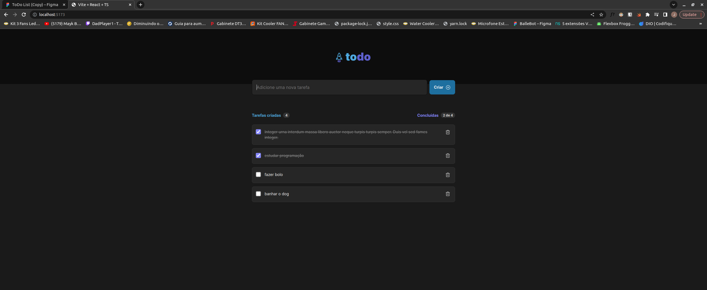

<div align="center">
          
</div>

---

## 💻 Projeto

Projeto Desenvolvido através de um desafio disponibilizado pela Rocketseat, com intuito de praticar o conhecimento adquirido nas aulas de ReactJs.
O Foco do projeto basicamente foi criar um todo list com as funcionalidades de criar uma nova tarefa, remover tarefa, marcar como concluída, verificar quantas tarefas ja foram criadas
e quantas ja foram concluídas.

## Começando...

```bash
npm install
# ou
yarn
```

## Iniciando o projeto

Execute o projeto com:

```bash
npm run dev
# ou
yarn dev
```

A aplicação tem como objetivo reforçar fundamentos do ReactJS como:

- Estado
- Componentização
- Propriedades
- Comunicação entre componentes
- Imutabilidade
- Programação declarativa
- Percorrer um array com a função map do javascript
- Validação de formulário

## 🚀 Tecnologias

Esse projeto foi desenvolvido com as seguintes tecnologias:

- Vite
- React Js
- Typescript
- css modules
- phosphor-react
- uuid

---

### link para poder utilizar o projeto desenvolvido.

- https://jolly-torte-1c1559.netlify.app/
